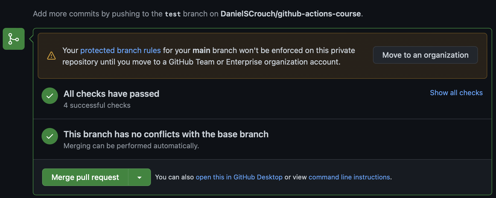

# GitHub Actions CI-Pipeline

This project demos a ci-pipeline using a simple Go API app, e2e test using minikube and a GitHub Actions workflow.

GitHub Actions [Documentation](https://docs.github.com/en/actions)


---

## GitHub Config & Secrets

1. [Enabling Debug Logging](https://docs.github.com/en/actions/monitoring-and-troubleshooting-workflows/enabling-debug-logging)
2. Code Owners: https://docs.github.com/en/repositories/managing-your-repositorys-settings-and-features/customizing-your-repository/about-code-owners
3. [Add GitHub branch protection rule](https://docs.github.com/en/repositories/configuring-branches-and-merges-in-your-repository/defining-the-mergeability-of-pull-requests/managing-a-branch-protection-rule)
   - Branch name pattern `main`
   - Require pull request reviews before merging (1)
   - Require status checks to pass before merging
   - Require branches to be up to date before merging
   - Include administrators
4. Create private DockerHub image repository `app`
5. Create access token
   - Add new access token `Account Settings` -> `Security` -> `New Access Token`
   - Access Token Description: `ci-pipeline`
   - Access Permissions: `Read & Write & Delete`
6. Create a Docker config file (on Linux, or Mac without credentials store)

   ```bash
    docker login -u duartcs
    # Password/Access Token input

    cat ~/.docker/config.json
    # {
    #    "auths": {
    #        "https://index.docker.io/v1/": {
    #            "auth": "c2FmZVGlQYW5jOTV2a19ncXZEb1hpVEU="
    #        }
    #    }
    #}
   ```

7. Generate Kubernetes secret from Docker `config.json` file

   ```bash
   kubectl create secret generic regcred \
   --from-file=.dockerconfigjson=/Users/home/Desktop/tmpdockerconfig.json \
   --type=kubernetes.io/dockerconfigjson \
   --dry-run=client \
   -o yaml

   # apiVersion: v1
   # kind: Secret
   # type: kubernetes.io/dockerconfigjson
   # metadata:
   #    name: regcred
   # data:
   #    .dockerconfigjson: ewoJIodHRwc2luZGV4LmRvY2tlci5pby92MS8i
   ```

8. Add DockerHub username and access key as secret to GitHub

   - Navigate to repository -> `Settings` -> `Security` -> `Secrets` -> `Actions`
   - Name: `DOCKERHUB_USERNAME`
   - Name: `DOCKERHUB_TOKEN`

9. Add Kubernetes secret for DockerHub as secret to GitHub
   - Navigate to repository -> `Settings` -> `Security` -> `Secrets` -> `Actions`
   - Name: `K8_SECRET_DOCKERHUB`

---

## Pull Request Workflow - Running


---

## Pull Request Workflow - Complete

<!--  -->

